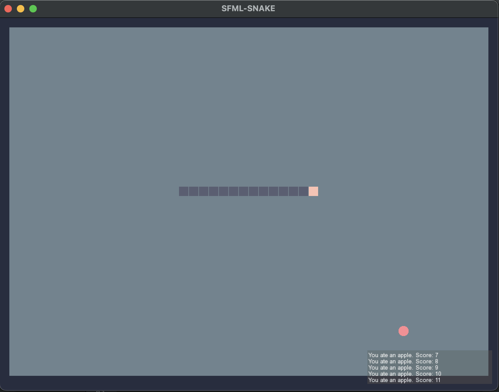

# SFML Snake
This is a Snake game developed with the SFML (Simple and Fast Multimedia Library) framework, version 3.0.1. The application has several scenes, including: Intro, Game and Paused. Additionally, the SFML::Audio module is used and there are sounds and music. The snake is controlled by arrows, the P button is pause and Backspace takes us to the Intro.

## Screenshots

## Addons
* [SFML website](https://www.sfml-dev.org)
* [Music](https://opengameart.org/content/gameboy-song-1) - opengameart
* [PickUpSFX](https://opengameart.org/content/level-up-power-up-coin-get-13-sounds) and [HitSFX](https://www.leshylabs.com/apps/sfMaker/) - opengameart / leshylabs
